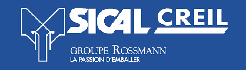
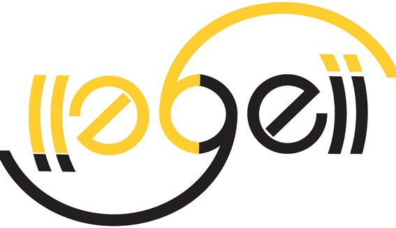
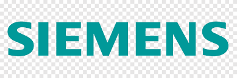

<!DOCTYPE html>
<html lang="fr">
<head>
<meta charset="UTF-8">
<title>pageweb-geii-Dumont</title>

<link href="https://fonts.googleapis.com/css2?family=Poppins:wght@300;400;600;700&display=swap" rel="stylesheet">

</head>

<body>

<header>
    
    <h1>Mathis Dumont</h1>
    
Étudiant BUT GEII

    
Alternant technicien de maintenance

</header>

<nav>
    <button onclick="afficherSection('accueil')">Accueil</button>
    <button onclick="afficherSection('profil')">Profil</button>
    <button onclick="afficherSection('experience')">Expérience</button>
    <button onclick="afficherSection('formation')">Formation</button>
    <button onclick="afficherSection('competences')">Compétences</button>
    <button onclick="afficherSection('contact')">Contact</button>
</nav>

<section id="accueil" class="active">
    <h2>Bienvenue</h2>
    
Bienvenue sur mon site personnel <strong>pageweb-geii-Dumont</strong>.

    
Vous y trouverez mon parcours, mes compétences et mon expérience professionnelle.

</section>

<section id="profil">
    <h2>Profil</h2>
    
Étudiant en Génie Électrique et Informatique Industrielle, passionné par la maintenance et l’automatisation.

    
Mon CV

    <a href="CV_Mathis_Dumont.pdf" target="_blank" class="cv-button">📄 Télécharger mon CV</a>

    <iframe src="CV_Mathis_Dumont.pdf" width="100%" height="500"
        style="border-radius:12px; border:1px solid #dde3ec; margin-top:18px;"></iframe>
</section>

<section id="experience">
    <h2>Expérience</h2>

    

        

            
Alternant technicien de maintenance

            
SICAL Groupe Rossmann – Creil

            <ul>
                <li>Maintenance industrielle</li>
                <li>Dépannage</li>
                <li>Diagnostic</li>
            </ul>
        

        

            
        

    

</section>

<section id="formation">
    <h2>Formation</h2>

    

        

            
BUT GEII

            
IUT Cuffies Jules Verne

            <ul>
                <li>Automatisation</li>
                <li>API Siemens</li>
                <li>Électrotechnique</li>
            </ul>
        

        

            
        

    

</section>

<section id="competences">
    <h2>Compétences</h2>

    

        <ul>
            <li>Maintenance industrielle</li>
            <li>Automatisation</li>
            <li>API Siemens</li>
            <li>Électricité industrielle</li>
        </ul>

        

            
            
        

    

</section>

<section id="contact">
    <h2>Contact</h2>
    
Email : <strong>mathis.dumont60@gmail.com</strong>

    
Téléphone : <strong>06 42 31 13 63</strong>

</section>

<footer>
    © 2026 – pageweb-geii-Dumont | Mathis Dumont
</footer>

</body>
</html>
